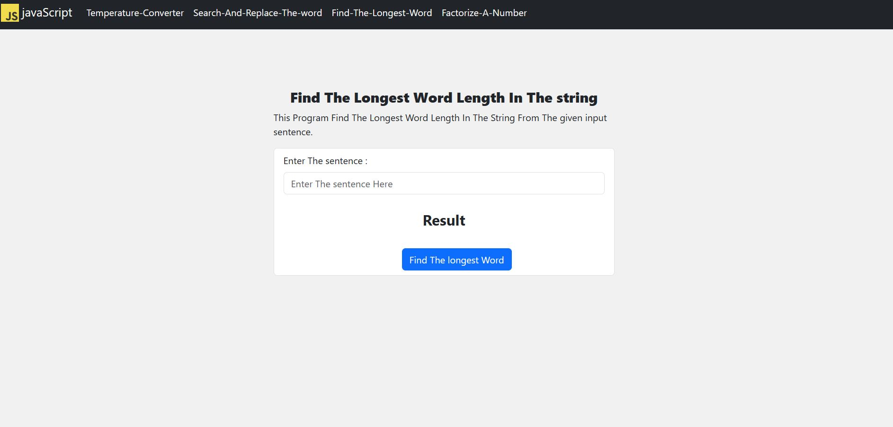

# This is a JavaScript Problem Solving Project

* This project is built using  HTML, CSS, Bootstrap and JavaScript.  
* This project has some Examples of problem-solving for JavaScript Practices. 
* So if you are interested in problem-solving skills then this repository has some of that staff.

